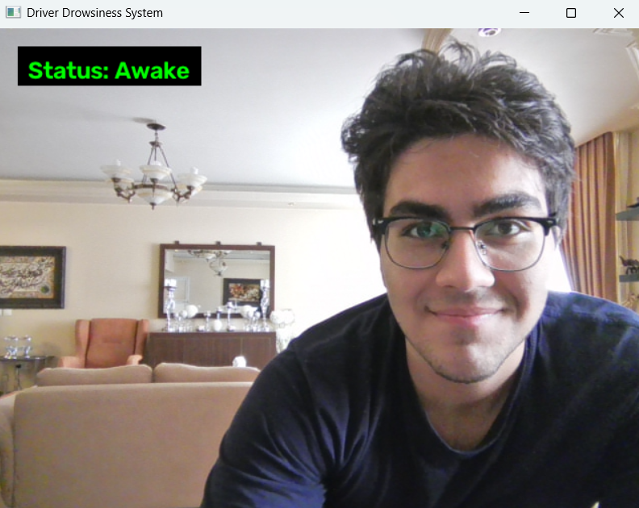
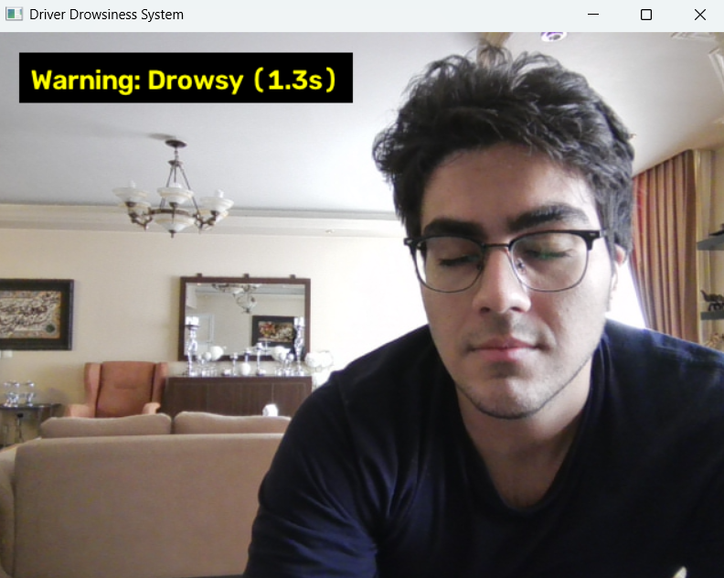
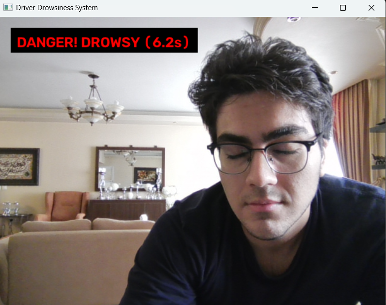
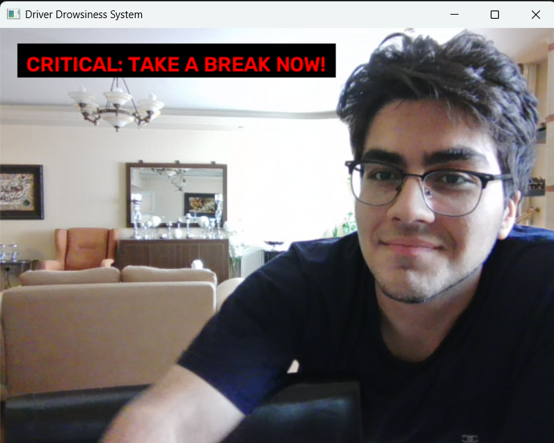

# Real-Time Driver Drowsiness & Fatigue Detection System

[](https://www.python.org/)
[](https://github.com/ultralytics/ultralytics)
[](https://opencv.org/)
[](https://pyga.me)
[](https://opensource.org/licenses/MIT)

A fully integrated real-time driver monitoring system powered by advanced computer vision techniques. The system utilizes a fine-tuned YOLOv8 object detection model combined with an adaptive temporal fatigue analysis pipeline (Sliding Window Fatigue Queue) to accurately track attentiveness, identify micro-sleep events, and evaluate fatigue trends. It operates in a non-intrusive manner while providing low-latency, multi-channel auditory feedback for critical safety intervention.

---

## Screenshots & Demo

### Live Detection & UI Overlay

| Awake State | Drowsy Warning (5s) | Danger State | Critical Alert |
| :---: | :---: | :---: | :---: |
|  |  |  |  |
| *Normal driving condition* | *Short-term audio loop active* | *High risk drowsiness detected* | *Persistent fatigue alert* |

## Key Features

- **High-Accuracy Eye State Detection:** Real-time object detection categorizing driver state into `awake` and `drowsy` at high FPS using custom-tuned YOLOv8 weights.
- **Dual-Stage Adaptive Alert Framework:**
  - **Stage 1 (Micro-sleep Alert):** Triggers a continuous warning audio loop if eye closure persists for $\ge 5.0$ seconds. Audio stops **instantly** the moment the driver opens their eyes.
  - **Stage 2 (Chronic Fatigue Break Warning):** Tracks repeated drowsiness episodes across time. If 4 or more drowsiness events occur within a 2-minute window, the system escalates to an emergency "Take a Break" critical warning.
- **Non-Blocking Multi-Threaded Audio Engine:** Custom audio manager utilizing `pygame.mixer` independent channels, eliminating video lag and frame freezes during sound playback.
- **Dynamic HUD & UI Overlay:** Modern, semi-transparent background cards displaying live state, exact closure duration, and alert status directly on the OpenCV feed.
- **Robust Application Lifecycle:** Full cleanup of hardware resources (webcam and audio channels) with graceful handling of OS window close events (X button) and exit shortcuts (`q`).

---

## Project Architecture

```text
driver-drowsiness-system/
│
├── assets/
│   ├── images/                      
│   │   ├── awake_status.png
│   │   ├── drowsy_warning.png
│   │   ├── critical_alert.png
│   │   └── drowsy_danger.png
│   ├── warning.mp3
│   └── critical.mp3
|
├── models/                  # Custom trained YOLOv8 model weights
│   └── best.pt
│
├── trains/                  # Colab training workflow
│   │          
│   └── train_drowsy_detection_model.ipynb
│
├── src/                     # Core system modules
│   │               
│   ├── __init__.py
│   ├── detector.py          # YOLOv8 inference pipeline
│   ├── fatigue_analyzer.py   # Sliding-window fatigue algorithm
│   └── audio_player.py      # Non-blocking multi-channel sound engine
│
├── utils/                   # Helper functions
│   ├── __init__.py
│   └── helpers.py           # OpenCV UI rendering engine
│
├── .gitignore               # Ignored build ,cache and env files
├── config.py                # Centralized project configuration
├── main.py                  # Primary application entrypoint
└── requirements.txt         # Environment dependencies

```

## Dataset & Training Pipeline

### 1. Dataset Curation & Data Split Ratio
The dataset was curated and structured using **Roboflow Universe**, specifically annotated to distinguish between driver states (`awake` and `drowsy`):

To ensure robust generalization and prevent overfitting, the dataset was split into three independent subsets:
- **Train Set (68%):** Used for weight optimization during training.
- **Validation Set (19%):** Used for monitoring loss and hyperparameter tuning during 50 epochs.
- **Test Set (13%):** Reserved for unbiased performance evaluation.

- **Source:** Roboflow Universe`
- **Format:** YOLOv8 PyTorch format
- **Roboflow Dataset Link:** [Driver Drowsiness System Dataset](https://universe.roboflow.com/mobin-yaghooti/driver-drowsiness-system)

### 2. Training Configuration (Google Colab T4 GPU)
The model was fine-tuned on Google Colab using a Tesla T4 GPU instance:
- **Base Model:** `yolov8n.pt` (Nano variant for high FPS edge inference)
- **Epochs:** 50
- **Batch Size:** Auto (AdamW optimizer)
- **Image Resolution:** $640 \times 640$ pixels
- **Notebook Reference:** `trains/train_drowsy_detection_model.ipynb`

### 3. Model Performance & Evaluation Metrics
The model achieved high convergence and precision across all metrics after 50 epochs:

| Class | Images | Instances | Precision (P) | Recall (R) | mAP@50 | mAP@50-95 |
| :--- | :---: | :---: | :---: | :---: | :---: | :---: |
| **all** | 143 | 143 | **0.958** | **0.994** | **0.994** | **0.937** |
| **awake** | 83 | 83 | 0.951 | 0.988 | 0.994 | 0.937 |
| **drowsy** | 60 | 60 | 0.966 | 1.000 | 0.994 | 0.936 |

> **Inference Speed:** ~0.3ms preprocess, ~4.2ms inference per image on T4 GPU.


###  Technical Deep-Dive & System Methodology

#### 1. Computer Vision Pipeline (`src/detector.py`)
Unlike traditional landmark-based methods (e.g., EAR calculation using Dlib/MediaPipe) which degrade severely under head rotation or dark lighting, this system treats drowsiness detection as an end-to-end Object Detection task.  
- Bounding box detections are filtered using a confidence threshold ($\ge 0.70$).  
- Higher contextual features are extracted, allowing accurate identification even when drivers wear glasses or tilt their heads.

#### 2. Time Persistence State Machine (`main.py`)
To prevent false alarms caused by normal eye blinks, a time-persistence gate evaluates eye-closure duration:  

$$T_{\text{drowsy}} = t_{\text{current}} - t_{\text{start}}$$

- If $T_{\text{drowsy}} < 5.0\text{s}$, the system flags a Warning state on the UI without playing sound.  
- If $T_{\text{drowsy}} \ge 5.0\text{s}$, an alert is triggered, audio begins looping, and an alert record is sent to the Fatigue Analyzer.  
- Opening eyes immediately resets duration timers and stops the short-term alert audio.  

#### 3. Sliding Window Fatigue Algorithm (`src/fatigue_analyzer.py`)
Driver fatigue is cumulative. The system maintains a time-stamped history queue of all triggered alerts and evaluates fatigue over a moving window:  

$$\text{Queue} = \{ t \in \text{Alerts} \mid (t_{\text{current}} - t) \le W_{\text{fatigue}} \}$$

- **Window Size ($W_{\text{fatigue}}$):** $120\text{ seconds}$ (2 minutes).  
- **Trigger Condition:** When $|\text{Queue}| \ge 4$, a Critical Fatigue State is declared, activating the prolonged emergency warning.

###  Configuration & Thresholds

All operational metrics can be customized in `config.py`:  

| Parameter | Default Value | Description |
| :--- | :---: | :--- |
| `CONFIDENCE_THRESHOLD` | `0.70` | YOLOv8 minimum detection confidence threshold |
| `DROWSY_TIME_LIMIT` | `5.0 sec` | Continuous eye-closure threshold for short alert |
| `FATIGUE_WINDOW_SEC` | `120 sec` | Time window duration for cumulative fatigue tracking |
| `FATIGUE_ALERT_LIMIT` | `4 alerts` | Alert count required within window to trigger critical state |
| `CRITICAL_SOUND_DURATION_SEC` | `15.0 sec` | Playback duration limit for emergency critical audio |

---

###  Key Technical Challenges & Engineering Solutions

- **Preventing Video Stuttering During Sound Playback:** Standard sound playback calls can block the main execution thread.
  - *Solution:* Implemented `AudioPlayer` using `pygame.mixer` with assigned audio channels (`Channel(0)` for warnings, `Channel(1)` for critical alerts), allowing asynchronous playback without lowering video FPS.
- **Handling Normal Eye Blinks:**
  - *Solution:* Implemented a $5.0\text{-second}$ temporal filter (`DROWSY_TIME_LIMIT`) to ignore natural blinks while reliably detecting true micro-sleep.
- **Resource Leaks on GUI Termination:**
  - *Solution:* Included OpenCV window property checks (`cv2.getWindowProperty(...) < 0`) inside the main loop to safely release webcam hardware and audio threads when users close the window using the OS close button.


###  Getting Started

#### Prerequisites
- **Python:** 3.10+ installed.
- **Hardware:** Integrated or USB Webcam connected to your computer.

---

#### Installation

1. **Clone the repository:**
   ```bash
   git clone https://github.com/mobyiin/driver-drowsiness-system.git
   cd driver-drowsiness-system
   ```

2. **Create and activate a Virtual Environment:**
   ```bash
   python -m venv .venv

   # On Windows:
   .venv\Scripts\activate

   # On Linux/macOS:
   source .venv/bin/activate
   ```
3. **Install Dependencies:**
   ```bash
   pip install -r requirements.txt
   ```


### Running the Application

1. Verify that your trained model (`best.pt`) is located in the `models/` directory and audio files (`warning.mp3`, `critical.mp3`) exist in `assets/`.  
2. Launch the execution script:
   ```bash
   python main.py
   ```
3. To stop the application, press `q` or click the window's red Close (X) button.

### Author & Acknowledgments

- **Developer:** Mobin Yaghooti
- **Special Thanks:** [Ultralytics](https://github.com/ultralytics) for the YOLOv8 framework and [Roboflow](https://roboflow.com) for dataset management tools.

---

### License

Distributed under the MIT License. See `LICENSE` for more information.
